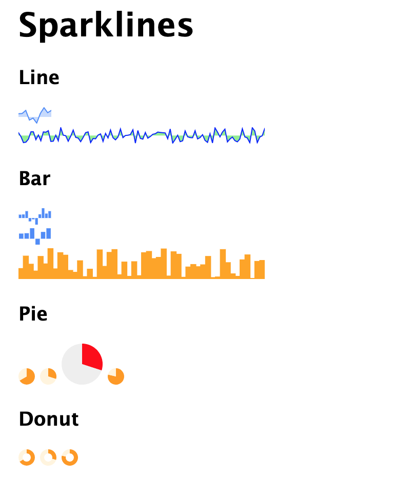

# Peity Vanilla Rails

[](https://www.railsjazz.com)

Sparklines are small but intense charts. This gem is a wrapper around [peity-vanilla](https://github.com/railsjazz/peity_vanilla) library. You can generate simple but informative charts with vanilla JS.



## Usage

1. add gem to the `Gemfile`

```ruby
gem "peity_vanilla_rails"
```

2. Add to `application.js`

### For Assets Pipeline:

```javascript
//= require peity-vanilla-rails.js
```

### For Importmaps

In `application.js`

```js
import "peity-vanilla-rails";
```

#### Note: After `peity-vanilla-rails.js` is imported, it will listen to changes of `peity` and `data-peity` attributes of every DOM element
Pure `peity-vanilla` library is also acessible via `peity-vanilla.js` for Assets Pipeline, and `import peity from "peity-vanilla"` for Importmaps

3. Add charts in your code:

```erb
<h3>Line</h3>
<%= peity_line_chart([115,123,234,-113,-43,-223,127,332,152,233]) %>
<%= peity_line_chart(100.times.map{rand(100) * [1,-1].sample}, options: { width: 240, fill: 'lightgreen', stroke: 'blue' }) %>

<h3>Bar</h3>
<%= peity_bar_chart([115,123,234,-113,-43,-223,127,332,152,233]) %>
<%= peity_bar_chart('115,123,234,-132,152,233') %>
<%= peity_bar_chart(50.times.map{rand(100) }, options: { width: 240, fill: ['orange'], height: 30, padding: -0.1 }) %>

<h3>Pie</h3>
<%= peity_pie_chart "2/3" %>
<%= peity_pie_chart [3,10] %>
<%= peity_pie_chart [3,10], options: { fill: ["red", "#eeeeee"], radius: 10 } %>
<%= peity_pie_chart [236,300] %>

<h3>Donut</h3>
<%= peity_donut_chart "2/3" %>
<%= peity_donut_chart [6,20] %>
<%= peity_donut_chart [236,300] %>
```

## More Examples

Check the [original](https://github.com/railsjazz/peity_vanilla) page.


```erb
<%= peity_line_chart([5,3,9,6,5,9,7,3,5,2,5,3,9,6,5,9,7,3,5,2], id: 'updating-chart') %>

<script>
  var updatingChart = document.getElementById("updating-chart");
  
  setInterval(function() {
    var random = Math.round(Math.random() * 10)
    var values = updatingChart.innerText.split(",")
    values.shift()
    values.push(random)

    updatingChart.innerText = values.join(",")
  }, 1000);
</script>
```

## Default Options

More information here: https://github.com/railsjazz/peity_vanilla.

You can pass in `options` any of the attributes.

```html
<script>
  peity.defaults.pie = {
    delimiter: null,
    fill: ["#58508d", "#ffa600", "#ff6361"],
    height: null,
    radius: 8,
    width: null
  }

  peity.defaults.donut = {
    delimiter: null,
    fill: ["#ff9900", "#fff4dd", "#ffd592"],
    height: null,
    innerRadius: null,
    radius: 8,
    width: null
  }

  peity.defaults.line = {
    delimiter: ",",
    fill: "#fff4dd",
    height: 16,
    max: null,
    min: 0,
    stroke: "#ffa600",
    strokeWidth: 1,
    width: 32
  }

  peity.defaults.bar = {
    delimiter: ",",
    fill: ["#4d89f9"],
    height: 16,
    max: null,
    min: 0,
    padding: 0.1,
    width: 32
  } 
</script>
```

## TODO

- remote datasource and autoupdate

## Contributing

You are welcome to contribute.

## License

The gem is available as open source under the terms of the [MIT License](https://opensource.org/licenses/MIT).
